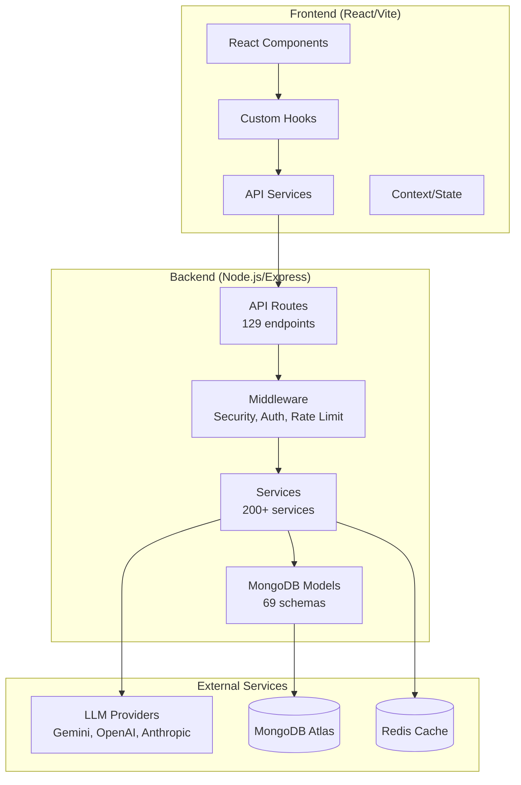

# 🚀 OrbitAI

**The Autonomous Software Architect** - AI-powered brainstorming and project generation platform.

## Architecture Overview



## Quick Start

```bash
# Clone and install
git clone <repo>
npm install
cd server && npm install && cd ..

# Configure environment
cp server/.env.example server/.env
# Add your MongoDB URI and API keys to server/.env

# Start development servers
./start-all.sh
# Or manually:
npm run dev --workspace=client &
npm run dev --workspace=server
```

**Frontend:** http://localhost:5173  
**Backend:** http://localhost:3002  
**API Docs:** http://localhost:3002/api-docs

## Project Structure

```
ORBITAI-Clean/
├── client/               # React frontend
│   ├── src/
│   │   ├── components/   # UI components
│   │   ├── services/     # API clients
│   │   ├── hooks/        # React hooks
│   │   ├── contexts/     # State management
│   │   └── utils/        # Helpers
│   └── .eslintrc.cjs     # ESLint config
├── server/               # Express backend
│   └── src/
│       ├── routes/       # API endpoints (129)
│       ├── services/     # Business logic (200+)
│       ├── models/       # MongoDB models (69)
│       ├── middleware/   # Auth, rate limit, etc.
│       └── validators/   # Input validation
├── shared/               # Shared TypeScript types
└── docs/                 # Documentation
```

## Key Features

- 🤖 **AI Brainstorming** - Interactive chat for project ideation
- 🔄 **LLM Router** - Intelligent routing across AI providers
- 📊 **Mind Map Visualization** - Visual idea organization
- 🎨 **Prototype Generation** - Auto-generate project previews
- 👤 **Admin Dashboard** - Full control panel
- 🔐 **Security** - Rate limiting, authentication, input validation

## Tech Stack

| Layer | Technologies |
|-------|-------------|
| Frontend | React 18, TypeScript, Vite, TailwindCSS |
| Backend | Node.js, Express, MongoDB, Redis |
| AI | Gemini, OpenAI, Anthropic, Claude |
| DevOps | Docker, Fly.io (deployment ready) |

## Environment Variables

See `server/.env.example` for required variables:
- `MONGODB_URI` - MongoDB connection string
- `GEMINI_API_KEY` - Primary LLM provider (or manage via Admin UI)
- `JWT_SECRET` - Authentication secret

## Deployment

See [DEPLOYMENT.md](DEPLOYMENT.md) for production deployment guide.

```bash
# Build for production
npm run build --workspace=client
npm run build --workspace=server

# Docker
docker-compose up --build
```

## Documentation

- [Product Overview](PRODUCT_EXPLANATION.md)
- [Deployment Guide](DEPLOYMENT.md)
- [Troubleshooting](TROUBLESHOOTING.md)
- [API Docs](http://localhost:3002/api-docs)

