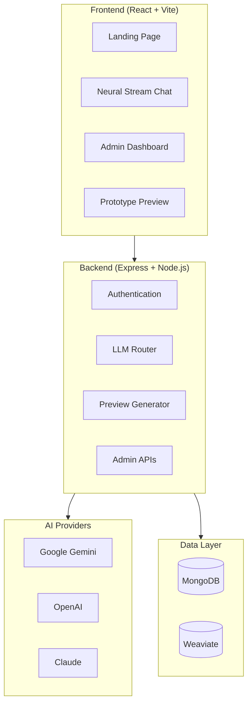
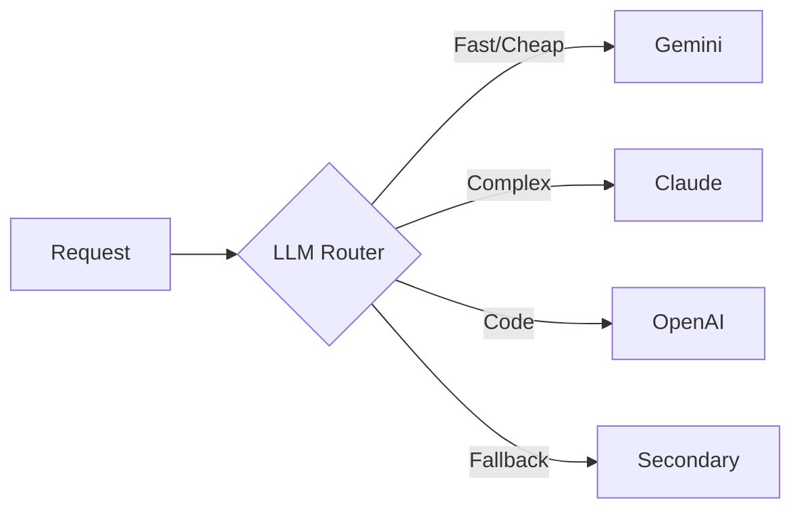
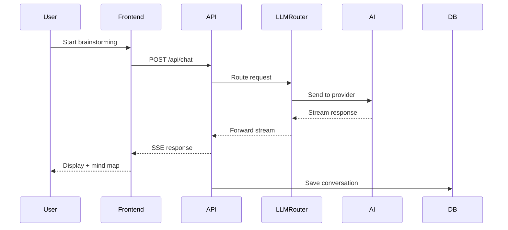

# OrbitAI Architecture

## System Overview

OrbitAI is a full-stack AI-powered software development platform with intelligent LLM routing.



---

## Tech Stack

| Layer | Technology |
|-------|------------|
| **Frontend** | React 18, TypeScript, Vite, TailwindCSS |
| **Backend** | Node.js, Express, TypeScript |
| **Database** | MongoDB (primary), Weaviate (vector) |
| **AI** | Gemini, OpenAI, Anthropic via LLM Router |
| **Real-time** | WebSocket, Socket.io |
| **Auth** | JWT + bcrypt |

---

## Core Components

### 1. LLM Router
Intelligent routing of AI requests across providers based on:
- Task type (brainstorming, code gen, analysis)
- Cost optimization
- Performance requirements
- Fallback handling



### 2. Neural Stream Chat
Real-time AI brainstorming interface with:
- Streaming responses
- Mind map visualization
- Idea extraction
- Project maturity tracking

### 3. Prototype Generator
Automated project generation:
- Blueprint creation
- Tech stack selection
- Code scaffolding
- Preview rendering

---

## Data Flow



---

## Directory Structure

```
ORBITAI-Clean/
├── components/           # React UI components (200+)
│   ├── neural-stream-chat/  # Main chat module
│   ├── admin-dashboard/     # Admin tabs
│   └── ...
├── services/             # Frontend API clients
├── hooks/                # Custom React hooks
├── contexts/             # React contexts (Auth, Theme)
├── server/               # Backend
│   ├── src/
│   │   ├── routes/       # API endpoints (100+)
│   │   ├── services/     # Business logic (170+)
│   │   ├── models/       # MongoDB schemas (60+)
│   │   └── middleware/   # Express middleware
│   └── scripts/          # Utility scripts
└── docs/                 # Documentation
```

---

## Key Design Decisions

1. **Monorepo Structure** - Single repo for frontend + backend
2. **LLM Abstraction** - Router layer decouples from providers
3. **Feature Flags** - Runtime feature control via Flagsmith
4. **API Key Security** - Encrypted storage in database, not env vars
5. **Modular Components** - Feature-based component organization
